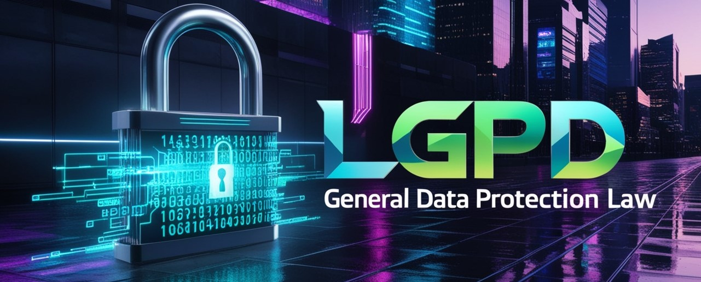

 

# LGPD e o Futuro da Privacidade: O Que Esperar da Nova Era Digital ?

> Introdução.

Olá, pessoal! Você sabia que seus dados, como seu nome, idade, fotos e até suas postagens nas redes sociais, são como seus brinquedos? Eles precisam ser bem cuidados e protegidos para que ninguém use ou veja sem a sua permissão. É aí que entra a LGPD, a Lei Geral de Proteção de Dados. Pense nela como um super-herói que protege todas as suas informações pessoais e garante que tudo fique seguro e sob controle. Vamos descobrir juntos como essa lei funciona e por que ela é tão importante para você e para todos nós! 🚀🔐

> Como a LGPD funciona.

A LGPD funciona como regras que as empresas têm que seguir para proteger seus dados. Elas precisam pedir sua permissão antes de usar as suas informações e garantir que estão guardadas bem direitinho, como seus brinquedos no cofre. 

Se elas não fizerem isso, podem levar uma bronca bem séria.

> Os Atributos da LGPD.

A LGPD tem várias regras importantes: 

- Transparência: Todos têm que saber o que estão fazendo com seus dados.
- Segurança: Proteger os dados direitinho para evitar que escapem.
- Consentimento: Pedir sua permissão antes de usar suas informações.
- Acesso: Você pode pedir para ver quais dados estão sendo usados.
- Correção: Você pode pedir para corrigir dados errados.
- Exclusão: Você pode pedir para apagar seus dados se quiser.

> No que a LGPD te assegura.

Responsabilidade e ressarcimento de danos:

A LGPD te assegura que seus dados estarão seguros, e que você sempre será avisado sobre como eles estão sendo usados e que você pode pedir para corrigir ou apagar suas informações se quiser. 

É como ter o poder de decidir quem brinca com seus brinquedos e como. E Isso quer dizer que a empresa pode ter que pagar pelos danos que causaram, como se fosse arrumar ou substituir os brinquedos que foram estragados. 

É como garantir que você não saia prejudicado por um erro que não foi seu. Se algo assim acontecer, você pode falar com um adulto e juntos procurar um advogado para ajudar a resolver a situação.

> Sanções e Responsabilidade Civil

Quando alguém não segue as regras da LGPD, pode levar uma bronca bem séria. Vamos ver o que acontece em caso de vazamento de dados, as sanções administrativas e a responsabilidade e ressarcimento de danos.

> Exemplo: Vazamento de dados

Imagina que alguém deixou a porta do seu cofre de brinquedos aberta e alguns brinquedos desapareceram. Isso é como um vazamento de dados, onde suas informações pessoais escapam e vão parar nas mãos erradas. Se isso acontecer, a empresa tem que te avisar rapidinho, explicar o que aconteceu e o que estão fazendo para consertar a bagunça. É uma forma de garantir que você saiba o que está rolando com seus dados.

> Sanções administrativas

Se uma empresa não seguir as regras da LGPD, pode levar várias broncas, que chamamos de sanções administrativas. Essas sanções podem incluir:

- Advertência: Uma bronca oficial, dizendo que a empresa fez algo errado e precisa melhorar.

- Multa: A empresa pode ter que pagar uma grana, que pode ser bem alta, tipo perder mesada por meses.

- Publicação da infração: A empresa pode ser obrigada a contar pra todo mundo que fez coisa errada.

- Bloqueio dos dados: Eles podem ser proibidos de usar seus dados até arrumarem a bagunça.

- Eliminação dos dados: A empresa pode ser obrigada a apagar os dados que coletou de forma errada.

> Posso processar se meu dado for vazado ?

Sim! Se alguém deixar suas informações escaparem, você pode falar com um adulto para te ajudar a processar a empresa responsável. É como chamar um adulto quando alguém quebra suas regras de brincar e estraga seus brinquedos. Você tem o direito de exigir justiça!

> Segue 10 exemplos sobre como a LGPD é aplicada na prática

- Cadastro em Loja Online: Quando você se cadastra em uma loja online, eles precisam pedir sua permissão para coletar e usar seus dados, como nome, endereço e e-mail.

- Assinatura de Newsletter: Ao assinar uma newsletter, a empresa deve informar como seu e-mail será utilizado e garantir que você pode cancelar a assinatura a qualquer momento.

- Aplicativos de Redes Sociais: Antes de usar um app de rede social, ele deve pedir permissão para acessar suas fotos, contatos e outras informações do seu celular.

- Formulários de Pesquisa: Se uma empresa usa formulários para coletar dados, eles precisam explicar por que estão coletando essas informações e como serão usadas.

- Promoções e Sorteios: Ao participar de promoções ou sorteios, a empresa deve deixar claro como seus dados serão usados e pedir sua autorização.

- Hospitais e Clínicas: Seus dados de saúde são dados sensíveis e as instituições de saúde devem protegê-los com muito cuidado, além de informar e pedir seu consentimento para utilizá-los.

- Câmeras de Segurança: Empresas que usam câmeras de segurança devem avisar que estão gravando e explicar como as imagens serão usadas e protegidas.

- Vazamento de Dados: Se uma empresa sofre um vazamento de dados, deve informar imediatamente os afetados e as autoridades, e tomar medidas para resolver o problema.

- Contratos de Trabalho: Empregadores devem proteger dados pessoais dos funcionários e só coletar informações realmente necessárias para o trabalho.

- Aplicativos de Saúde: Apps que monitoram sua saúde ou exercícios devem explicar claramente como seus dados serão usados e pedir permissão antes de coletá-los.

> Conclusão.

Curtiu quer aprender mais sobre a LGPD ?

- Siga a gente nas redes sociais para mais dicas e histórias legais sobre como proteger seus dados e sua privacidade! Vamos juntos brincar de proteger nossos dados de forma mais divertida e segura! 🚀🔒

> Fontes de produção

Esse Artigo foi gerador por inteligência artificial, mas foi revisado por alguém 100% Humano, e se quiser se conectar comigo, me siga no Linkedin: -> [Clique Aqui!](https://www.linkedin.com/in/davyd-c-b41b5b99/)

- Ilustrações de capa: Gerada pelo Leonardo.ia
- Conteúdo gerado por: ChatGPT e revisões humanas.
- Estilização feito pelo FIGMA: Davyd Cristiano.

#ProteçãoDeDados #SegurançaDigital #LGPDExplicada